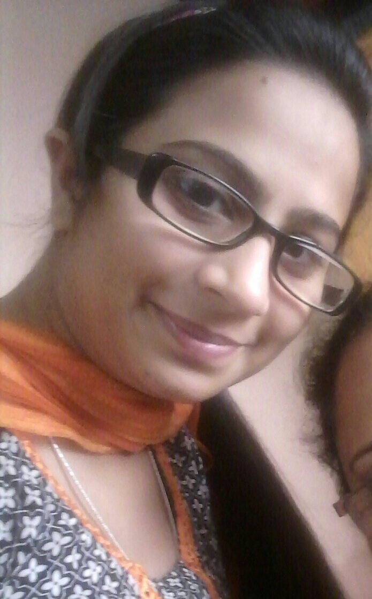

<html>
<head>

<title> My profile</title>
</head>
<body>

<label>
</label>

<h1>SHELLY SHARMA</h1>
<h3>Web Designer</h3>

E-MAIL:kbsharma417@gmail.com

CONTACT:8968086122

<h2>Personal Details</h2>

Date of Birth	: 12th July 1995 
Languages Known	: English, Hindi and Punjabi 
Gender	: Female 
Marital Status	: Unmarried 

<h2>Educational Qualification</h2>

Pursuing Bachelor of Technology (I.T) from Sri Sai College of Engineering And Technology, Manawala, Amritsar under Punjab technical university, Punjab. 
Completed Senior Secondary with 75% from Central Board of Secondary Education in 2013 (Punjab). 
 Completed Matriculation with 83% from Indian Certificate of Secondary Education in 2011(Punjab). 

<h2>Objective</h2>

To make sincere and continuous efforts towards building a promising career in leading technology and to take challenges in life so that I can contribute to the growth and success of the organization.

<h2>Projects</h2>

A project on college website using HTML and CSS. 
In which I have used the HTML code to design the different pages of my project and also learn how to store content using MySQL
. 

<h2>Skills and Interest</h2>

*HTML5 
*CSS3 
*Basic knowledge of PHP

</body>
</html>
